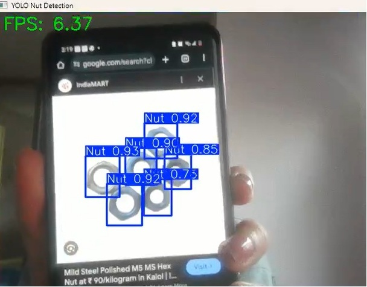

# Nut Detection Using YOLOv8

  

Real-time custom object detection using a YOLOv8 model trained to detect nuts in images and live video.

---

## Overview

This project demonstrates how to train, evaluate, and deploy a YOLOv8 detection model on a custom dataset containing a single class: **Nut**.
- Model trained using **Ultralytics YOLOv8**
- Deployed using **OpenCV** for real-time webcam detection

Pipeline includes dataset preparation, training, validation, and inference on images and live video.

---

## Project Structure
```
Yolo_Nut_detection/
├── dataset
├── results
├── screenshots
└── src
```

## Steps to Run
1. Install required libraries
```
pip install -r requirements.txt
```
2. Train YOLOv8 model
```
python src/yolo_train.py
```
3. Run inference on images
```
python src/yolo_infer.py --source dataset/valid/images
```
4. Run webcam detection
```
python src/yolo_webcam.py
```

## Results
- Prediction results are in `results/nut_detection/`
- Includes evaluation metrics: confusion matrix, precision/recall curves, F1 scores
- Sample screenshots in `screenshots/`



## Author
**Leila Bahman**

